# CUBE
In this repository we provide code of the paper:
> **Controllable Unsupervised Event-Based Video Generation**
> (accepted as ICIP Oral and invited by WACV workshop)
> 
> Yaping Zhao, Pei Zhang, Chutian Wang, Edmund Y. Lam
> 
> paper link: https://ieeexplore.ieee.org/abstract/document/10647468

<p align="center">
  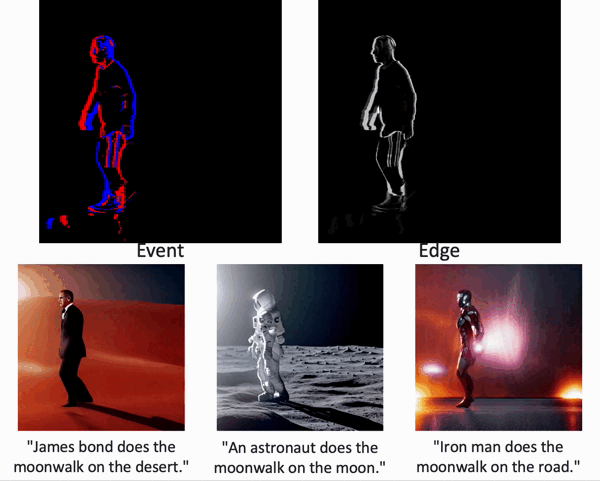
</p>

## Usage

### 1. Download Weight
All pre-trained weights are downloaded to `checkpoints/` directory, including the pre-trained weights of [Stable Diffusion v1.5](https://huggingface.co/runwayml/stable-diffusion-v1-5), ControlNet conditioned on [canny edges](https://huggingface.co/lllyasviel/sd-controlnet-canny). 
The `flownet.pkl` is the weights of [RIFE](https://github.com/megvii-research/ECCV2022-RIFE).
The final file tree likes:

```none
checkpoints
├── stable-diffusion-v1-5
├── sd-controlnet-canny
├── flownet.pkl
```

### 2. Requirements

```shell
conda create -n cube python=3.10
conda activate cube
pip install -r requirements.txt
```
`xformers` is recommended to save memory and running time.

### 3. Inference
To reproduce the main results from our paper, simply run:
```bash
sh inference_moonwalk.sh
sh inference_violin.sh
sh inference_sofa.sh
sh inference_man.sh
sh inference_girl.sh
```
To run you own experiment on text-to-video generation, modify the bash, e.g., `inference_moonwalk.sh`:
```bash
python inference.py \
    --prompt "James bond does the moonwalk on the desert." \
    --condition "canny" \
    --video_path "../data/moonwalk.mp4" \
    --output_path "outputs/" \
    --video_length 15 \
    --smoother_steps 19 20 \
    --width 512 \
    --height 512
    #--is_long_video
```
where `--video_length` is the length of synthesized video, `--condition` represents the type of structure sequence,
`--smoother_steps` determines at which timesteps to perform smoothing, and `--is_long_video` denotes whether to enable efficient long-video synthesis.

## Visualizations

<table class="center">
<tr>
  <td width=50% align="center">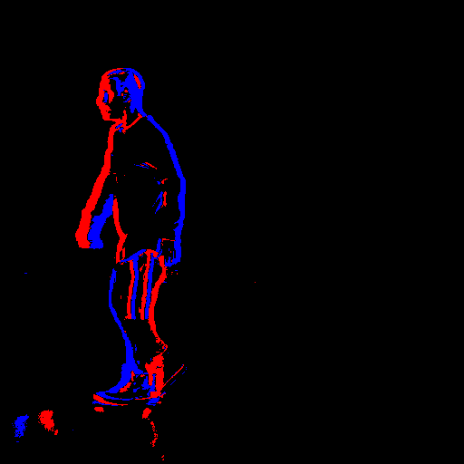</td>
  <td width=50% align="center">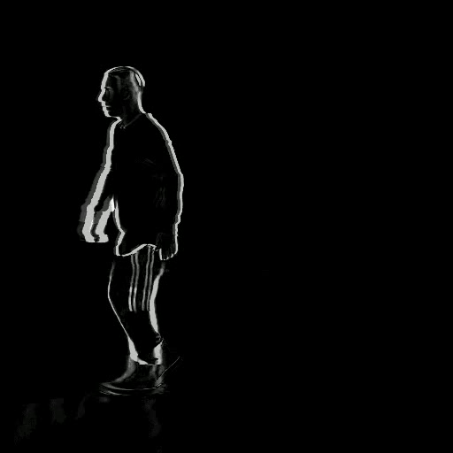</td>
</tr>
<tr>
  <td width=50% align="center">Event</td>
  <td width=50% align="center">Edge</td>
</tr>

</table>
<table>
 <tr>
	<td width=30% align="center">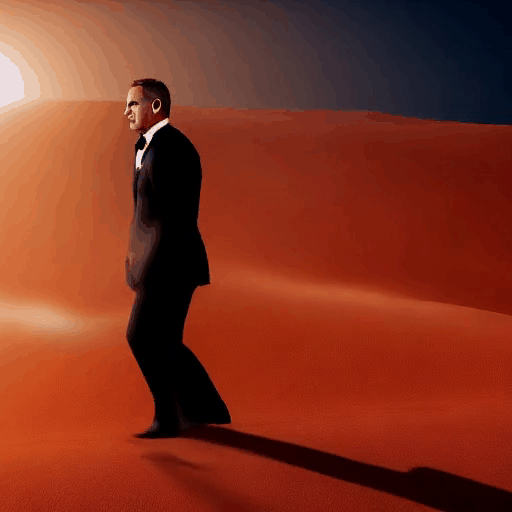</td>
  <td width=30% align="center">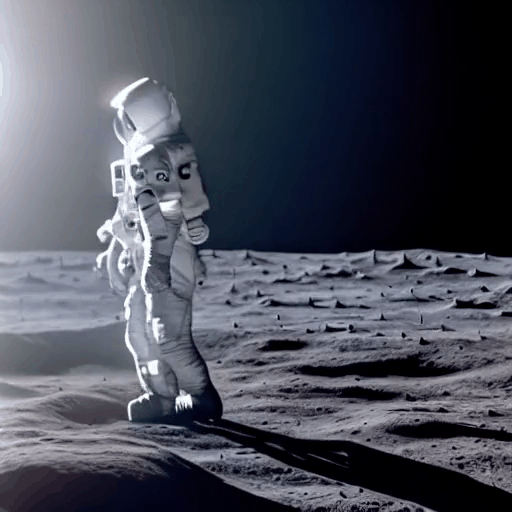</td>
	<td width=30% align="center">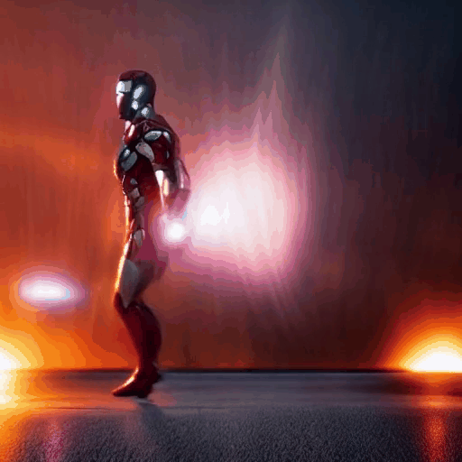</td>
</tr>
<tr>
  <td width=30% align="center">"James bond does the moonwalk on the desert."</td>
  <td width=30% align="center">"An astronaut does the moonwalk on the moon."</td>
  <td width=30% align="center">"Iron man does the moonwalk on the road."</td>
</tr>
</table>

<table class="center">
<tr>
  <td width=50% align="center">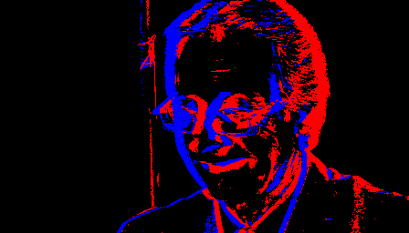</td>
  <td width=50% align="center">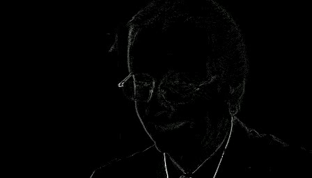</td>
</tr>
<tr>
  <td width=50% align="center">Event</td>
  <td width=50% align="center">Edge</td>
</tr>

</table>
<table>
 <tr>
	<td width=30% align="center">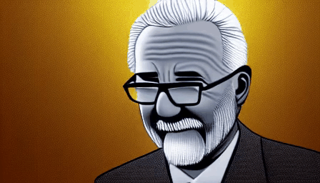</td>
  <td width=30% align="center"></td>
	<td width=30% align="center">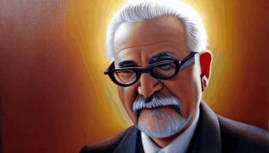</td>
</tr>
<tr>
  <td width=30% align="center">"An old man wearing a glass, cartoon."</td>
  <td width=30% align="center">"An old man wearing a glass, laughing."</td>
  <td width=30% align="center">"An old man wearing a glass, oil painting."</td>
</tr>
</table>

<table class="center">
<tr>
  <td width=50% align="center">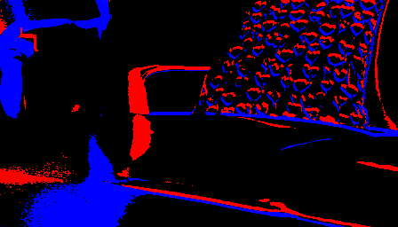</td>
  <td width=50% align="center">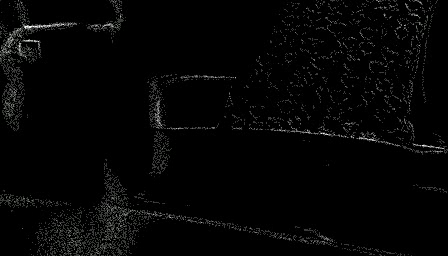</td>
</tr>
<tr>
  <td width=50% align="center">Event</td>
  <td width=50% align="center">Edge</td>
</tr>

</table>
<table>
 <tr>
	<td width=30% align="center"></td>
  <td width=30% align="center">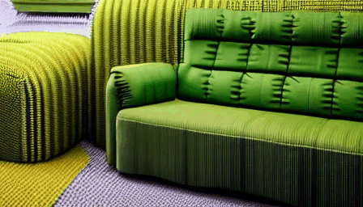</td>
	<td width=30% align="center"></td>
</tr>
<tr>
  <td width=30% align="center">"A blue sofa in a house."</td>
  <td width=30% align="center">"A green sofa in a house."</td>
  <td width=30% align="center">"A modern sofa in a house."</td>
</tr>
</table>

<table class="center">
<tr>
  <td width=50% align="center">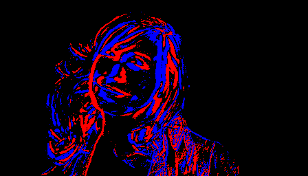</td>
  <td width=50% align="center"></td>
</tr>
<tr>
  <td width=50% align="center">Event</td>
  <td width=50% align="center">Edge</td>
</tr>

</table>
<table>
 <tr>
	<td width=30% align="center"></td>
  <td width=30% align="center"></td>
	<td width=30% align="center">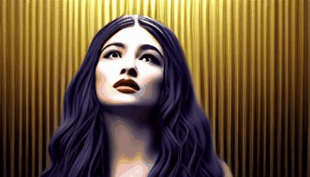</td>
</tr>
<tr>
  <td width=30% align="center">"A girl with golden hair, crying."</td>
  <td width=30% align="center">"A girl with golden hair, smiling."</td>
  <td width=30% align="center">"A girl with long hair, movie style."</td>
</tr>
</table>

## Citation
Cite our paper if you find it interesting!
```
@INPROCEEDINGS{zhao2024controllable,
  author={Zhao, Yaping and Zhang, Pei and Wang, Chutian and Lam, Edmund Y.},
  booktitle={EEE International Conference on Image Processing (ICIP)}, 
  title={Controllable Unsupervised Event-Based Video Generation}, 
  year={2024},
  pages={2278-2284},
  doi={10.1109/ICIP51287.2024.10647468}}
```

This code is implemented based on [ControlVideo](https://github.com/YBYBZhang/ControlVideo).